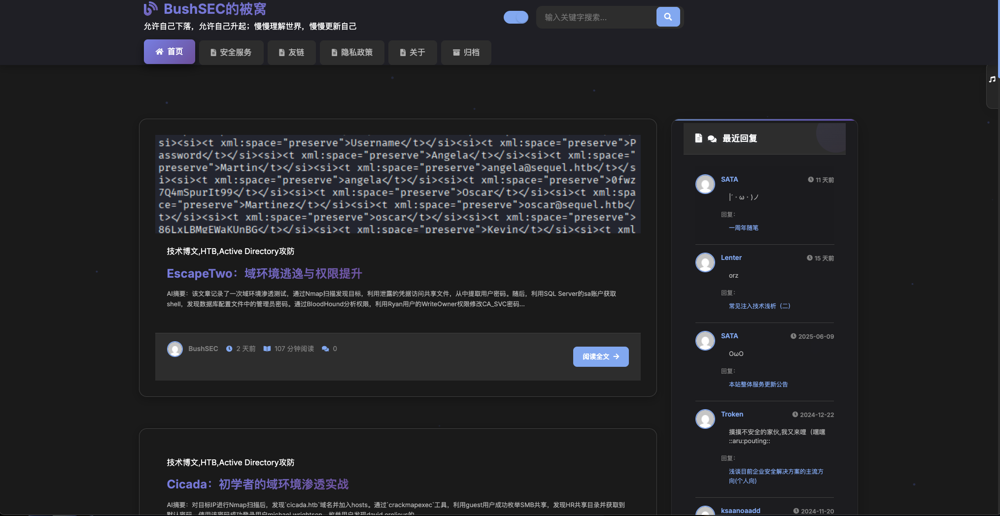
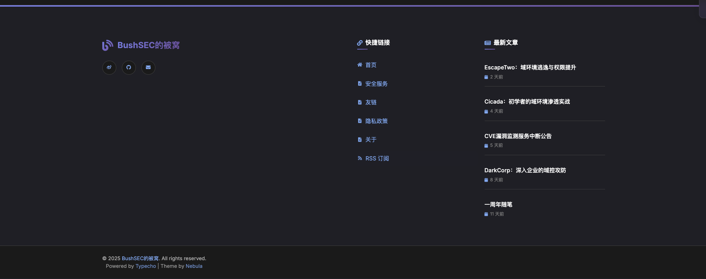

# Nebula for Typecho
## 施工阶段。目前还有许多未完善的部分

Nebula 是一款为 Typecho 博客系统的现代化响应式主题。适合个人博客、技术分享、生活记录等多种场景。

---

## 效果图



## 目录

- [目录结构](#目录结构)
- [安装方法](#安装方法)
- [主题配置](#主题配置)
  - [侧边栏模块](#侧边栏模块)
  - [社交链接](#社交链接)
- [自定义开发](#自定义开发)
- [常见问题](#常见问题)
- [预览截图](#预览截图)
- [更新日志](#更新日志)
- [许可协议](#许可协议)
- [致谢](#致谢)

---
- **本主题是基于typecho原版主题大幅魔改而来**

## 目录结构

```
Nebula/
├── 404.php                # 404 页面模板
├── archive.php            # 归档页面模板
├── comments.php           # 评论模板
├── footer.php             # 页脚模板
├── functions.php          # 主题函数与扩展
├── grid.css               # 栅格系统样式
├── header.php             # 页头模板
├── img/                   # 图片资源
│   ├── icon-search.png
│   └── icon-search@2x.png
├── index.php              # 首页模板
├── normalize.css          # CSS 重置
├── page.php               # 单页模板
├── post.php               # 文章页模板
├── screenshot.png         # 主题预览图
├── sidebar.php            # 侧边栏模板及样式
├── style.css              # 主题主样式
```

---

## 安装方法

1. **下载主题**
   - 通过 GitHub/Gitee 下载本主题，或直接克隆仓库：
     ```bash
     git clone https://github.com/BushANQ/Typechp-Nebula.git
     ```
2. **上传主题**
   - 将 `Nebula` 文件夹上传至 Typecho 博客 `/usr/themes/` 目录下。
3. **启用主题**
   - 登录 Typecho 后台，进入“控制台 → 外观”，选择并启用 Nebula 主题。

---

## 主题配置

### 侧边栏模块

在后台主题设置中，可自由勾选显示以下模块：

- 最近回复
- 分类目录
- 社交链接
- 功能菜单（RSS 订阅等）
- 标签云
- 网站统计

### 社交链接

在主题设置的“社交链接”栏填写，每行一个，格式如下：

```
名称|链接|图标类名
```

- **名称**：显示的社交平台名称
- **链接**：完整的 URL
- **图标类名**：Font Awesome 图标类名（可选，默认 `fas fa-link`）

**示例：**
```
GitHub|https://github.com/yourname|fab fa-github
微博|https://weibo.com/yourname|fab fa-weibo
Twitter|https://twitter.com/yourname|fab fa-twitter
```

---

## 自定义开发

- **样式自定义**：主要样式在 `style.css` 和 `grid.css`，可根据需求调整配色、圆角、阴影等。
- **模板扩展**：各页面模板结构清晰，便于添加自定义内容。
- **小组件开发**：可参考 `sidebar.php`，按需添加或修改侧边栏小工具。
- **变量与函数**：主题内大量使用 Typecho 原生 API，便于与插件协作。

---

## 常见问题

1. **主题激活后页面样式错乱？**
   - 请确保 `style.css`、`grid.css`、`normalize.css` 等样式文件已完整上传。
   - 检查浏览器控制台是否有 404 或跨域错误。

2. **社交图标不显示？**
   - 请确认 Font Awesome 已正确引入（主题已内置或通过 CDN）。
   - 图标类名需符合 Font Awesome 规范，如 `fab fa-github`。

3. **如何添加自定义小组件？**
   - 可在 `sidebar.php` 中仿照现有结构添加自定义 PHP 代码或 HTML。

4. **标签云颜色如何自定义？**
   - 可在 `sidebar.php` 的 `<script>` 部分修改 `colors` 数组，添加或替换颜色值。

---

## 目前已知存在的问题
   - 手机端兼容性目前较差
   - 归档页面暂未完工
   - 手机端的折叠菜单存在无法正常展开的BUG
   - 后台控制功能没做（）
   - 暂时没有考虑到安全设计
   - ......


## 更新日志

   -  2025-8-15：增加返回顶部按钮，并对样式进行了小幅优化


---

## 许可协议

本主题遵循 GPL-3.0 License，允许自由使用、修改和分发，但请保留原作者信息。

---

## 致谢

- [Typecho](https://typecho.org/) 博客系统
- [Font Awesome](https://fontawesome.com/) 图标库
- 以及所有开源社区的贡献者
